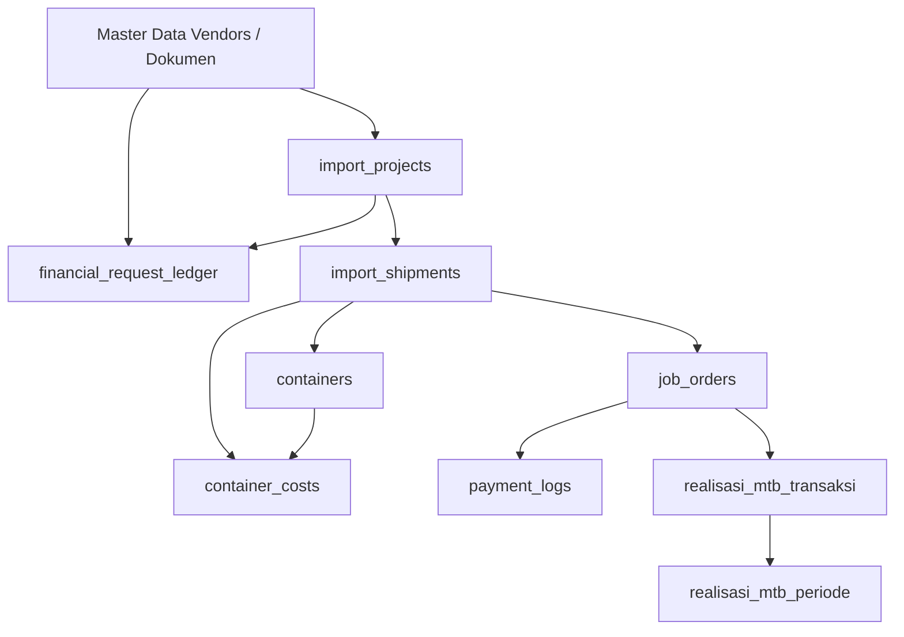

# KOMPAS EXIM ERP — Appendix & Engineering Best Practices

This document contains test cases, feature dependency matrices, historical architecture change logs, and software development guidelines for the KOMPAS EXIM ERP Import Department.

---

## 1. Feature Dependency Matrix

---

## 2. Test Suite & Validation Matrix

### Functional Test Suite
- **TC-FUNC-001**: Verify creation of `import_projects` auto-evaluates `ref_commitment_rules` via `CommitmentEngine`.
- **TC-FUNC-002**: Verify `ShipmentService.calculateShipmentStage()` transitions across all 4 stages.
- **TC-FUNC-003**: Verify `MtbService.processMtbTransaction()` updates `saldo_running` correctly.
- **TC-FUNC-004**: Verify `TaskService.getDepartmentHealth()` returns correct health score clamp [0, 100].

### Negative Test Suite
- **TC-NEG-001**: Attempt to assign unpaid Job Order (`total_paid < total_invoice`) to MTB → Expect `EligibilityRuleEngine` rejection (`NOT_PAID`).
- **TC-NEG-002**: Submit financial request missing required `request_number` or `sumber` → Expect HTTP 400 Bad Request error.

### Edge Case Test Suite
- **TC-EDGE-001**: Execute update query with stale version integer (`version = 1` when DB is `version = 2`) → Expect HTTP 409 Conflict.
- **TC-EDGE-002**: Query dashboard analytics for date range with zero completed shipments → Expect clean 0 values without `NaN` or crashes.

---

## 3. Architecture Change Log & Legacy Migration

- **v1.0 (Legacy Structure)**: Operational records linked exclusively by string `shipment_un`. No central domain services; UI components calculated stage and progress independently.
- **v2.0 (Current Implementation)**: Introduced **Dual-Key Strategy** (`import_shipment_id` FK with `shipment_un` fallback). Centralized business logic into `ShipmentService`, `FinancialService`, `TaskService`, `MtbService`, and `EligibilityRuleEngine`. Implemented Optimistic Concurrency Control (`version` column) and database audit history tables.

---

## 4. Engineering Best Practices: Do's & Don'ts

### DO:
- **DO** consume domain data via centralized domain services (`ShipmentService`, `FinancialService`, `TaskService`).
- **DO** pass JWT Bearer token in all HTTP requests requiring authentication.
- **DO** handle optimistic concurrency failures by prompting the user to refresh their view.

### DON'T:
- **DON'T** compute shipment stage or progress percentages inside React components—always call `ShipmentService`.
- **DON'T** bypass `EligibilityRuleEngine` when adding financial transactions.
- **DON'T** mutate database records directly without updating audit trail tables (`task_status_history`, `realisasi_mtb_history`).
