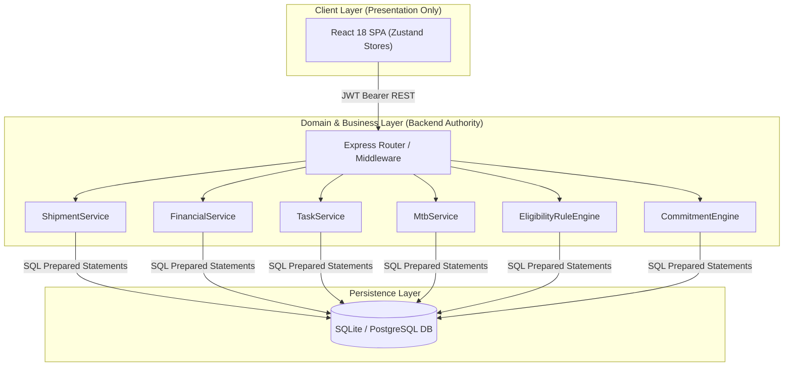
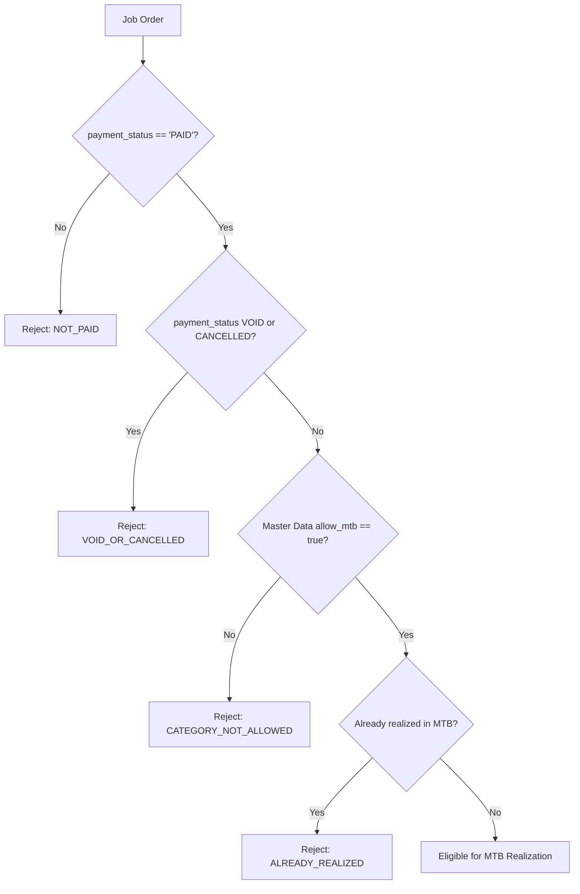
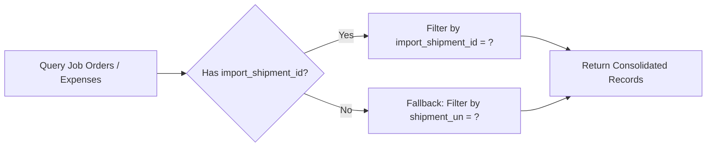
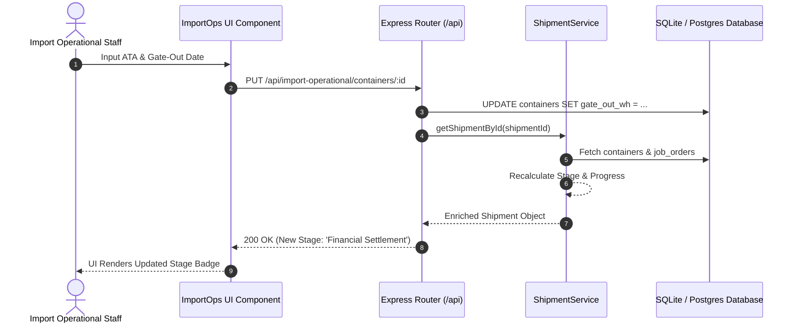

# KOMPAS EXIM ERP — Canonical System Architecture

## 1. Architectural Philosophy & Guiding Principles

The **KOMPAS EXIM ERP** architecture adheres to strict enterprise software standards designed to ensure data consistency, financial auditability, and scalability across operational and executive tiers.



### Core Architecture Pillars:
1. **Backend Authority**: Frontend components NEVER compute business KPIs, financial totals, or stage transitions locally. The backend Node.js domain services are the absolute authority.
2. **Single Source of Truth (SSOT)**: Every domain concept (e.g. shipment stage, payment status, department health score) is calculated in exactly ONE backend class method.
3. **Domain Ownership**: Database tables are owned exclusively by designated domain services. Modules consume domain data via service methods, never by inventing independent SQL queries.
4. **Audit Traceability**: Financial and status changes produce immutable historical records (`task_status_history`, `debit_note_status_history`, `realisasi_mtb_history`, `pib_request_history`).

---

## 2. Centralized Domain Services

### A. `ShipmentService` (`backend/src/domain/ShipmentService.js`)
Serves as the Single Source of Truth for all shipment operational lifecycle stages and analytics.

#### Core Stage Calculation Logic:
```javascript
// Rule 1: No ATA recorded -> Vessel in transit
if (!shipment.ata) return 'Shipment Active'; // Progress: 25%

// Rule 2: ATA recorded, but containers still at warehouse
if (!allContainersDelivered) return 'Delivery Active'; // Progress: 50%

// Rule 3: All containers delivered, but open vendor invoices exist
if (!allInvoicesPaid) return 'Financial Settlement'; // Progress: 75%

// Rule 4: All logistics and financial commitments fulfilled
return 'Status Complete'; // Progress: 100%
```

### B. `FinancialService` (`backend/src/domain/FinancialService.js`)
Centralized aggregator for cost categories, invoice totals, payments, and financial settlement KPIs.

#### Cost Classification Authority:
Maps raw vendor `cost_type` strings from `job_orders` into standardized financial buckets:
- `TRUC` → **Trucking**
- `LINE` → **Freight & Line**
- `PIB` / `CUSTOMS` / `PERIZINAN` → **Customs & PIB**
- `DEPO` → **Depo & Storage**
- `LOLO` → **Lolo & Reimb**
- `DO` → **DO/BL Fee**
- *Other* → **Other**

### C. `TaskService` (`backend/src/domain/TaskService.js`)
Calculates department workload metrics, staff completion rates, and department health scores.

#### Department Health Formula:
$$\text{Health Score} = \max\left(0, 100 - \left(\frac{\text{Overdue Tasks}}{\text{Total Tasks}} \times 100\right)\right)$$
- **Score ≥ 70**: *Sangat Baik* (Green)
- **40 ≤ Score < 70**: *Perlu Perhatian* (Yellow)
- **Score < 40**: *Kritis* (Red)

---

## 3. Dedicated Business Rule Engines

### A. `EligibilityRuleEngine` (`backend/src/services/EligibilityRuleEngine.js`)
Enforces gating conditions before records can enter downstream financial processing.



### B. `CommitmentEngine` (`backend/src/domain/commitmentEngine.js`)
Evaluates trade terms (Incoterms like FOB, CIF, EXW) and transport modes (FCL, LCL) upon project creation, automatically populating baseline financial ledger commitments in `financial_request_ledger`.

---

## 4. Dual-Key Relational Transition Strategy

To support smooth migration from legacy data structures without breaking historical records, the backend implements a **Dual-Key Lookup Strategy**:



- **New Records**: Linked via `import_shipment_id` (Integer Foreign Key to `import_shipments.id`).
- **Legacy Records**: Fall back to `shipment_un` (String Unique Identifier).
- **Domain Service Enforcement**: All domain service queries explicitly evaluate `(import_shipment_id = ? OR (import_shipment_id IS NULL AND shipment_un = ?))`.

---

## 5. Optimistic Locking & Transaction Concurrency

In financial modules like `MtbService`, concurrent updates could lead to race conditions or lost updates. To prevent this, the database schema enforces **Optimistic Concurrency Control**:

1. Every table record has a `version` integer column (default `1`).
2. When performing an update, the SQL query strictly enforces:
   `WHERE id = ? AND version = ?`
3. If `changes === 0`, another user modified the row concurrently. The transaction immediately rolls back and throws an HTTP 409 Conflict exception.

---

## 6. Service Boundaries & Data Lineage


