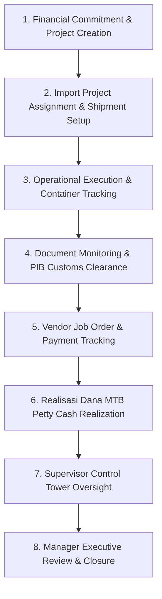
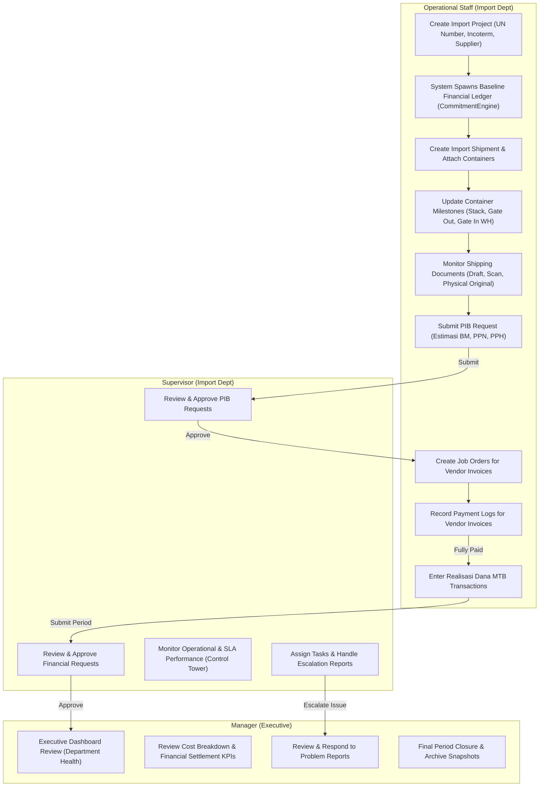

# KOMPAS EXIM ERP — End-to-End Business Processes

## 1. Import Department Workflow Overview

The **Import Department** in KOMPAS EXIM manages the complete lifecycle of inbound raw materials, indirect goods, assets, and miscellaneous shipments from international suppliers to domestic manufacturing plants or warehouses.

---

## 2. Master Business Process Flowchart

---

## 3. Detailed Operational Steps

### Step 1: Project Creation & Financial Commitment
- **Input**: Staff enters Supplier, Import Type (Raw Material, Indirect, Asset, etc.), Trade, Incoterm, Transport Mode, ETA, ETD, and HS Code in `AssignImportProject.jsx`.
- **System Action**: Trigger `CommitmentEngine.evaluate()`.
- **Output**: Record created in `import_projects`. Baseline cost requests auto-generated in `financial_request_ledger`.

### Step 2: Shipment Setup & Container Logistics
- **Input**: Staff creates shipment linked to `import_project_id`. Specifies container numbers, depo route, and destination warehouse.
- **System Action**: `ShipmentService` sets initial stage to `Shipment Active` (Progress: 25%).
- **Output**: Records created in `import_shipments` and `containers`.

### Step 3: Document Monitoring & PIB Customs Clearance
- **Input**: Staff tracks Draft BL/Invoice, Scanned Copies, and Physical Original AWB/BL in `DokumenMonitoringDetail.jsx`. Staff submits PIB kasbon request.
- **System Action**: Supervisor approves PIB request. Status changes `Submitted` → `Approved`.
- **Output**: Records updated in `dokumen_monitoring_baris` and `pib_requests`.

### Step 4: Container Execution & Delivery
- **Input**: Staff records vessel arrival (ATA), container stack date, gate out port, trucking vendor, and warehouse arrival/gate in/offloading dates.
- **System Action**: When ATA is set, stage auto-promotes to `Delivery Active` (Progress: 50%). When all containers have `gate_out_wh`, stage auto-promotes to `Financial Settlement` (Progress: 75%).
- **Output**: Records updated in `containers`.

### Step 5: Vendor Job Orders & Invoice Settlement
- **Input**: Staff inputs vendor invoices (Trucking, Freight, Depo, Lolo, DO) into Payment Tracker. Records partial/full payments in Payment Modal.
- **System Action**: `FinancialService` aggregates totals. When all linked `job_orders` are `Lunas`, stage auto-promotes to `Status Complete` (Progress: 100%).
- **Output**: Records created/updated in `job_orders` and `payment_logs`.

### Step 6: Realisasi Dana MTB (Petty Cash Realization)
- **Input**: Paid Job Orders eligible via `EligibilityRuleEngine` are assigned to open MTB period. Staff fills kwitansi, tax deductions (PPh23), and bank admin.
- **System Action**: `MtbService` executes atomic transaction, updates running balances (`saldo_running`), and logs audit entry in `realisasi_mtb_history`.
- **Output**: Records created in `realisasi_mtb_transaksi`.

### Step 7: Supervisor Control Tower & Task Management
- **Input**: Supervisor monitors SLA bottlenecks, unassigned tasks, and overdue clearance in `ControlTower.jsx`.
- **System Action**: `TaskService` calculates department workload and staff completion rates.
- **Output**: Tasks assigned to staff; escalation reports generated if needed.

### Step 8: Manager Review & Archival
- **Input**: Manager reviews executive dashboard widgets (Department Health, Cost Breakdown, SLA Analytics) and problem reports.
- **System Action**: Manager provides feedback/approval on reports; snapshot archived in `archive_snapshots`.
- **Output**: Closed project cycle.

---

## 4. Cross-Module Data Flow Matrix

| Source Module | Data Transferred | Destination Module | Permitted Mutation |
| :--- | :--- | :--- | :--- |
| **Import Operational** | Project UN, Supplier, Invoice, BL | **Payment Tracker** | Read-Only Linkage |
| **Payment Tracker** | Job Order ID, Amount, Payment Status | **Realisasi Dana MTB** | Strict Gating (`EligibilityRuleEngine`) |
| **PIB Request** | Request Number, Kasbon Amount | **Financial Ledger** | Auto-Sync on Approval |
| **Import Operational** | ETA vs ATA Dates | **Supervisor Control Tower** | Calculated SLA Metrics |
| **Payment Tracker** | Invoice Totals & Paid Balances | **Manager Executive Dashboard** | Aggregated Financial KPI |
