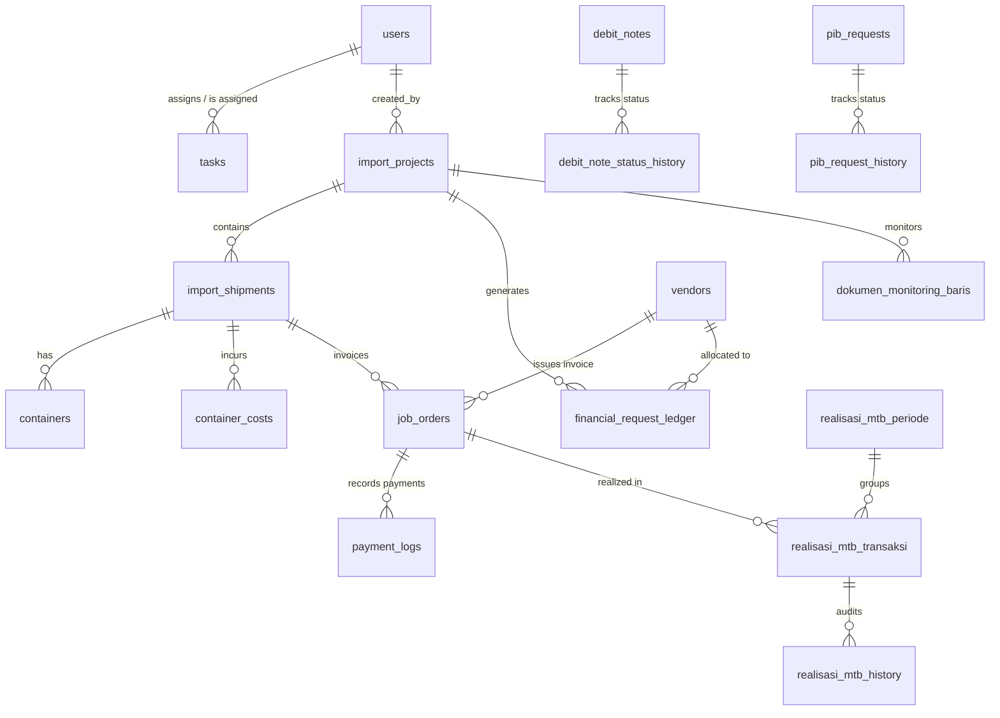

# KOMPAS EXIM ERP — Database Schema & ERD Reference

This document provides a comprehensive technical schema reference for all 22 relational database tables powering the KOMPAS EXIM ERP system (`backend/src/database/schema.sql`).

---

## 1. Entity Relationship Diagram (ERD)

---

## 2. Table Specifications Catalog

### A. Core User Management Table (`users`)
- **Primary Key**: `id` (INTEGER AUTOINCREMENT)
- **Columns**: `employee_id` (TEXT UNIQUE NOT NULL), `nama` (TEXT), `level_otoritas` (CHECK: `'Manager'|'Supervisor'|'Staff Dept'`), `departemen`, `password_hash`.

### B. Import Operational Tables
1. **`import_projects`**: Stores high-level purchasing project parameters (`task_unique_number`, `supplier`, `import_type`, `incoterm`, `eta`, `bl_no`).
2. **`import_shipments`**: Stores physical shipment instances (`shipment_code`, `import_project_id`, `un`, `ata`, `etd`, `eta`, `supplier`).
3. **`containers`**: Stores individual container logistics milestones (`shipment_id`, `no_kontainer`, `gate_out`, `gate_in_wh`, `gate_out_wh`, `fish_issue`, `queue_issue`, `space_issue`, `other_issue`).
4. **`container_costs`**: Stores per-container storage, monitoring, recooling, and detention charges.

### C. Financial & Settlement Tables
1. **`financial_request_ledger`**: Stores pre-calculated Incoterm commitments and manual financial requests.
2. **`job_orders`**: Stores vendor billing invoices (`job_order_code`, `vendor_id`, `cost_type`, `dpp`, `ppn`, `total_invoice`, `total_paid`).
3. **`payment_logs`**: Stores itemized payment records for job orders (`job_order_id`, `jumlah_bayar`, `tanggal_bayar`, `metode`).
4. **`realisasi_mtb_periode`**: Groups petty cash realization periods (`nama_periode`, `saldo_awal`, `saldo_akhir`, `status`).
5. **`realisasi_mtb_transaksi`**: Realization transaction ledger with optimistic locking versioning (`periode_id`, `kredit`, `debet`, `saldo_running`, `version`).
6. **`debit_notes`**: Vendor claim records (`dn_number`, `claim_kategori`, `jumlah_klaim`, `status`).
7. **`pib_requests`**: Customs duty kasbon requests (`request_number`, `aju_pib`, `kasbon_diminta`, `status`).

---

## 3. Indexing & Optimization Strategy

To ensure high-speed querying across large operational datasets, the database maintains targeted indexes:
- `idx_frl_project` ON `financial_request_ledger(import_project_id)`
- `idx_containers_shipment` ON `containers(shipment_id)`
- `idx_jo_shipment_un` ON `job_orders(shipment_un)`
- `idx_mtb_tx_periode` ON `realisasi_mtb_transaksi(periode_id)`
