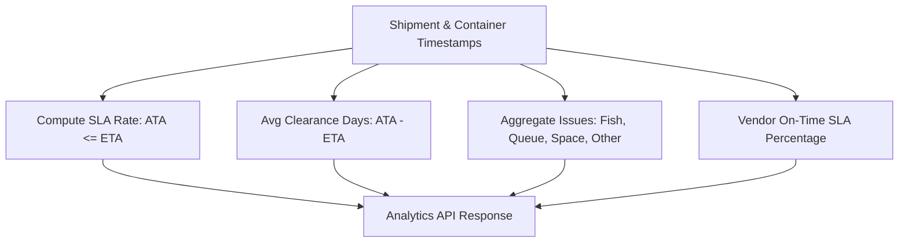

# Feature Documentation: Operational Analytics & SLA Metrics

## 1. Business Purpose & Overview

The **Operational Analytics & SLA Metrics** module evaluates logistics performance based on real operational timestamps. It replaces hardcoded mock metrics with real-time computations of shipment SLA rates, ETA vs ATA clearance times, container delay classifications, and vendor performance ratings.

- **Module Owner**: Import Operations Manager / Quality Assurance.
- **Related Modules**: Import Operational (`import_shipments`, `containers`), Supervisor Control Tower.
- **Implementation Status**: **Current Implementation** (Powered by `ShipmentService.getAnalytics()`).

---

## 2. Calculated Analytics Metrics (`ShipmentService.getAnalytics`)

### Metrics Formula Summary:

1. **Shipment Performance**: Monthly breakdown of shipments where $\text{ATA} \le \text{ETA}$ (On-Time) vs $\text{ATA} > \text{ETA}$ (Delayed).
2. **Average Clearance Time**:
   $$\text{Avg Clearance Days} = \frac{\sum |\text{ATA} - \text{ETA}|}{\text{Total Shipments with ATA}}$$
3. **SLA Compliance Rate**:
   $$\text{SLA Rate} = \left(\frac{\text{Count of On-Time Shipments}}{\text{Total Completed Shipments}}\right) \times 100\%$$
4. **Delay Reason Breakdown**: Aggregates container-level issue flags (`fish_issue`, `queue_issue`, `space_issue`, `other_issue`).

---

## 3. Functional & Edge Testing Checklist

- [x] **Functional Test**: Update shipment ATA to be earlier than ETA → verify monthly `shipmentPerformance` on-time count increments.
- [x] **Edge Case**: Dataset with zero ATA records → verify analytics endpoint returns 0 clearance time without crashing.
