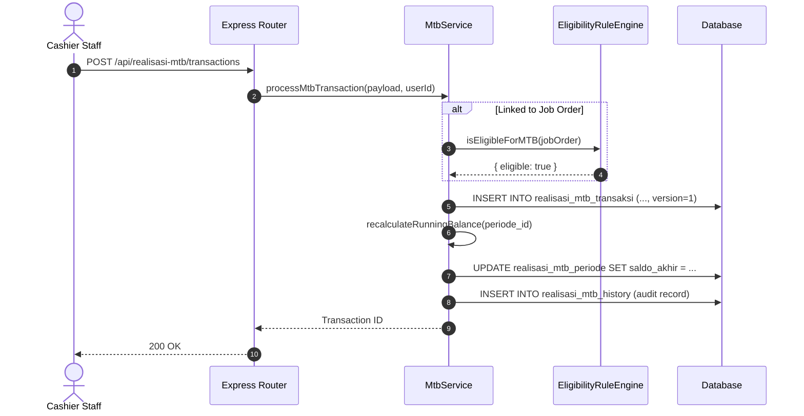

# Feature Documentation: Realisasi Dana MTB (Petty Cash Realization)

## 1. Business Purpose & Overview

The **Realisasi Dana MTB** module manages petty cash realizations, advance settlements, and operational cash disbursements. It maintains strict financial period accounting, enforces running balance calculations (`saldo_running`), and gates transaction eligibility using the `EligibilityRuleEngine`.

- **Module Owner**: Import Petty Cash Cashier & Finance Supervisor.
- **Related Modules**: Payment Tracker (`job_orders`), Master Data, Supervisor Approval Center.
- **Implementation Status**: **Current Implementation** (Period management, running balance recalculation, transaction CRUD, audit trail, and optimistic locking fully operational).

---

## 2. User Roles & Access Control

| Role | Allowed Actions | Restrictions | Approval Flow |
| :--- | :--- | :--- | :--- |
| **Staff Dept** | Create periods, enter/edit/delete transactions in `Draft` periods | Cannot edit transactions in `Submitted` / `Approved` periods | Draft → Submitted |
| **Supervisor** | Review period transactions, execute multi-stage checks (`Checked1`, `Checked2`, `Checked3`) | Cannot alter locked historical transactions | Checked1 → Checked2 → Approved |
| **Manager** | Perform final approval & review period balance summaries | Read-only / Final Approval | Final Approval |
| **Admin** | Full system access | N/A | N/A |

---

## 3. Navigation Path & UI Description

- **Navigation Path**: `Workspace` → `Finance` → `Realisasi Dana` → `Tab MTB` (`/workspace/finance/realisasi-dana`)
- **UI Components**: `RealisasiDanaLayout.jsx`, `TabMtb.jsx`, `TabMtbDetail.jsx`

```
┌────────────────────────────────────────────────────────────────────────┐
│ [Screenshot Placeholder: Realisasi Dana MTB Transaction Table UI]      │
│ Description: Excel-style accounting table showing Debit, Kredit,       │
│ Tax Deductions (PPh23), and Auto-Calculated Running Balance.          │
└────────────────────────────────────────────────────────────────────────┘
```

---

## 4. Field-by-Field Documentation

### Database Table: `realisasi_mtb_periode`

| Field Name | Database Column | Data Type | Required | Validation Rules | Business Meaning | Example Value |
| :--- | :--- | :--- | :--- | :--- | :--- | :--- |
| Periode Name | `nama_periode` | `VARCHAR` | YES | Non-empty | Descriptive period label | `MTB August 2026` |
| Start Date | `tanggal_mulai` | `TEXT` | YES | Date format | Period opening date | `2026-08-01` |
| End Date | `tanggal_selesai` | `TEXT` | YES | Date format | Period closing date | `2026-08-31` |
| Opening Balance | `saldo_awal` | `REAL` | YES | Numeric ≥ 0 | Initial cash balance | `50000000.00` |
| Closing Balance | `saldo_akhir` | `REAL` | NO | Auto-calculated | Final calculated balance | `42150000.00` |
| Status | `status` | `VARCHAR` | YES | Enum (`Draft`, `Submitted`, `Checked1`, `Approved`) | Approval stage | `'Draft'` |

### Database Table: `realisasi_mtb_transaksi`

| Field Name | Database Column | Data Type | Required | Default Value | Business Meaning | Example Value |
| :--- | :--- | :--- | :--- | :--- | :--- | :--- |
| Payment Date | `tgl_payment` | `TEXT` | YES | N/A | Date cash was paid | `2026-08-05` |
| Category | `category` | `VARCHAR` | YES | N/A | Expense category | `'LOLO (Reimb)'` |
| Debet | `debet` | `REAL` | NO | `0` | Cash inflow / advance top-up | `10000000.00` |
| Kredit | `kredit` | `REAL` | NO | Auto-calculated | Net cash outflow | `3500000.00` |
| PPh 23 Deduction | `pot_pph23_diskon` | `REAL` | NO | `0` | Tax withholding deduction | `70000.00` |
| Running Balance | `saldo_running` | `REAL` | NO | Auto-calculated | Cumulative period balance | `4650000.00` |
| Optimistic Version | `version` | `INTEGER` | YES | `1` | Concurrency locking version | `2` |

---

## 5. Backend API Specifications & Running Balance Engine

### `MtbService.recalculateRunningBalance(periode_id)`
Executes within database transactions to recompute cumulative balances whenever transactions are inserted, updated, or soft-deleted (`is_deleted = 1`):

$$\text{Running Balance}_n = \text{Running Balance}_{n-1} - \text{Kredit}_n + \text{Debet}_n$$



---

## 6. Functional, Negative & Edge Testing Checklist

- [x] **Functional Test**: Insert transaction in active MTB period → verify running balance recalculates automatically.
- [x] **Negative Test**: Attempt to edit transaction in an `Approved` period → verify HTTP 400 forbidden state.
- [x] **Edge Case (Optimistic Lock)**: Two users attempt to edit the same transaction simultaneously → second user receives HTTP 409 Conflict with version mismatch error.
