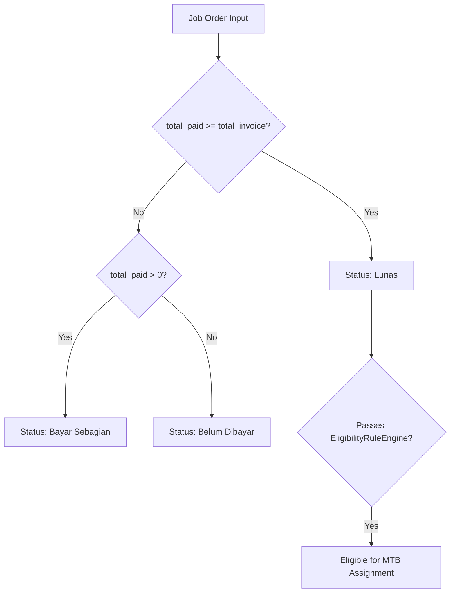

# Feature Documentation: Payment Tracker & Job Orders

## 1. Business Purpose & Overview

The **Payment Tracker & Job Orders** module manages vendor invoices, billing reconciliation, and payment disbursements for import logistics expenses. It links vendor invoices directly to specific operational shipments and container activities, preventing double billing and enabling exact cost tracking.

- **Module Owner**: Import Finance Staff & Accounts Payable.
- **Related Modules**: Import Operational (`import_shipments`), Realisasi Dana MTB (`realisasi_mtb_transaksi`), Manager Dashboard.
- **Implementation Status**: **Current Implementation** (Job Orders, payment logs, partial payment tracking, and MTB assignment fully operational).

---

## 2. User Roles & Access Control

| Role | Allowed Actions | Restrictions | Approval Flow |
| :--- | :--- | :--- | :--- |
| **Staff Dept** | Add invoice, record payment log, assign to MTB | Cannot delete locked job orders | Direct input |
| **Supervisor** | View payment status, review invoice amounts | Read/Write access | Approval review |
| **Manager** | View financial settlement metrics | Read-only executive view | N/A |
| **Admin** | Full system permissions | N/A | N/A |

---

## 3. Navigation Path & UI Description

- **Navigation Path**: `Workspace` → `Payment Tracker` (`/workspace/payment`)
- **UI Components**: `PaymentDashboard.jsx`, `AddInvoiceModal.jsx`, `UpdatePaymentModal.jsx`, `PaymentHistoryModal.jsx`, `AssignToMtbModal.jsx`

```
┌────────────────────────────────────────────────────────────────────────┐
│ [Screenshot Placeholder: Payment Tracker Dashboard UI]                │
│ Description: Summary cards showing Total Invoice, Total Paid, and     │
│ Outstanding Balance, alongside the Job Order table.                   │
└────────────────────────────────────────────────────────────────────────┘
```

---

## 4. Field-by-Field Documentation

### Database Table: `job_orders`

| Field Name | Database Column | Data Type | Required | Default Value | Validation Rules | Business Meaning | Example Value |
| :--- | :--- | :--- | :--- | :--- | :--- | :--- | :--- |
| JO Code | `job_order_code` | `VARCHAR` | YES | Auto-generated | Unique string (`JO-{timestamp}`) | Job Order unique identifier | `JO-1722950001` |
| Vendor | `vendor_id` | `INTEGER` | YES | `NULL` | FK to `vendors(id)` | Logistics service provider | `4` |
| Cost Category | `cost_type` | `VARCHAR` | YES | N/A | Standardized cost type | Category of cost (Trucking, Freight, Depo) | `'TRUC (Warehouse)'` |
| Invoice No | `invoice_no` | `VARCHAR` | YES | N/A | Non-empty string | Vendor invoice number | `INV-2026-9812` |
| DPP | `dpp` | `REAL` | YES | `0` | Numeric ≥ 0 | Tax base amount | `5000000.00` |
| Tax % | `persen_ppn` | `REAL` | NO | `11.0` | Numeric (0-100) | VAT percentage | `11.0` |
| PPN Amount | `ppn` | `REAL` | NO | `0` | Numeric ≥ 0 | Computed PPN tax amount | `550000.00` |
| Total Invoice | `total_invoice` | `REAL` | YES | `0` | Numeric > 0 | Total invoice billing amount | `5550000.00` |
| Total Paid | `total_paid` | `REAL` | YES | `0` | Numeric ≥ 0 | Accumulated payments | `5550000.00` |

---

## 5. Button Actions & Interactive Dialogs

| Button Name | UI Location | Action / Behavior | Backend API Called |
| :--- | :--- | :--- | :--- |
| **+ Tambah Invoice** | Dashboard Action | Opens `AddInvoiceModal` | `POST /api/job-orders` |
| **Bayar / Update** | Job Order Row | Opens `UpdatePaymentModal` to log payment | `POST /api/job-orders/:id/payments` |
| **Riwayat Bayar** | Job Order Row | Opens `PaymentHistoryModal` | `GET /api/job-orders/:id/payments` |
| **Assign to MTB** | Job Order Row | Assigns fully paid JO to active MTB period | `POST /api/realisasi-mtb/transactions` |

---

## 6. Backend API Specifications

### Endpoint: `POST /api/job-orders/:id/payments`
- **Method**: `POST`
- **Purpose**: Records a new payment log entry and auto-updates `total_paid` and status on `job_orders`.
- **Request Body**:
```json
{
  "jumlah_bayar": 2500000,
  "tanggal_bayar": "2026-08-06",
  "metode": "Bank Transfer",
  "file_bukti_path": "/uploads/proof-1234.pdf"
}
```

---

## 7. Business Rules & Status Calculations

The payment status of a Job Order is dynamically calculated by `statusBadgeJO()`:
- `Lunas` (Fully Paid): `total_paid >= total_invoice` AND `total_invoice > 0`.
- `Bayar Sebagian` (Partial): `total_paid > 0` AND `total_paid < total_invoice`.
- `Belum Dibayar` (Unpaid): `total_paid === 0`.



---

## 8. Functional & Edge Testing Checklist

- [x] **Functional Test**: Record payment equal to `total_invoice` → verify status updates to `Lunas`.
- [x] **Negative Test**: Submit payment exceeding total invoice without overpay authorization → verify status handling.
- [x] **Edge Case**: Concurrent payments logged simultaneously → database transaction locks update `total_paid` atomically.
