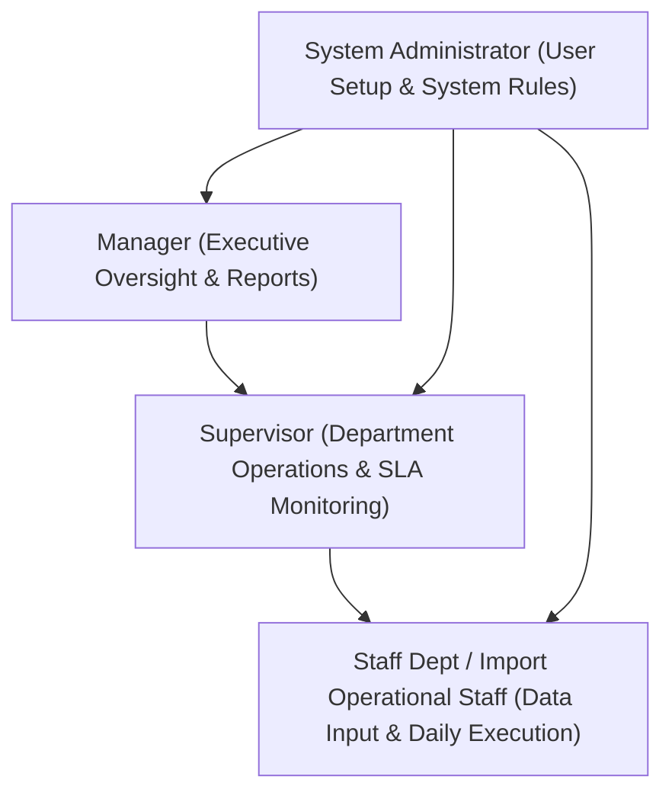

# KOMPAS EXIM ERP — Executive System Overview

## 1. Executive Summary & Business Purpose

**KOMPAS EXIM ERP** is an enterprise-grade Import & Export Resource Planning system built to manage complex international trade logistics, customs clearance, vendor performance, financial commitments, invoice settlements, and petty cash realizations (*Realisasi Dana MTB*).

The **Import Department Module** forms the backbone of the system, automating the complete lifecycle of inbound shipments from initial purchasing/commitment through container clearance at ports to final financial ledger settlement.

### Why This System Exists

Before KOMPAS EXIM ERP, import operations faced significant operational and financial challenges:
1. **Spreadsheet Silos & Data Fragmentation**: Operational staff tracked shipments in disconnected Excel sheets, while finance tracked payments separately, leading to discrepancies in cost totals and container demurrage status.
2. **Lack of Financial Traceability**: Lack of single-source-of-truth cost categories made it difficult to compare estimated commitments against actual invoiced amounts.
3. **Container Storage & Demurrage Losses**: Lack of automated container issue tracking (e.g. Fish Issue, Queue Issue, Space Issue) resulted in unmonitored container detention and storage fees.
4. **Approval & Realization Bottlenecks**: Petty cash (*MTB*) realizations and customs PIB payments suffered from manual audit delays and lack of optimistic locking against duplicate claims.

---

## 2. Core Problems Solved

| Problem Area | Legacy State | KOMPAS EXIM ERP Solution |
| :--- | :--- | :--- |
| **Shipment Stage Tracking** | Manual status updates across multiple sheets | Centralized `ShipmentService` auto-calculating 4 distinct operational stages (`Shipment Active`, `Delivery Active`, `Financial Settlement`, `Status Complete`). |
| **Financial Commitment** | Untracked initial commitments | Automated `CommitmentEngine` evaluating Incoterms & transport modes to spawn pre-calculated financial ledger requests. |
| **Vendor Invoice Tracking** | Loose receipt management | `JobOrders` table linking vendor invoices directly to specific shipments with real-time status (`Belum Dibayar`, `Bayar Sebagian`, `Lunas`). |
| **Petty Cash (MTB) Realization** | Paper-based receipts & unverified balances | Transacted `MtbService` with strict `EligibilityRuleEngine` gating, running balance calculations, and transaction audit trails. |
| **Executive Oversight** | Delayed monthly reports | Real-time **Supervisor Control Tower** and **Manager Executive Dashboard** fed by domain aggregator services. |

---

## 3. Department Ownership & Stakeholder Roles

- **Module Owner**: Import Department Head / Import Operations Manager.
- **Operational Owners**: Import Logistics Staff & Import Customs Officers.
- **Financial Approvers**: Import Supervisor, Finance Officer, and General Manager.
- **Related Departments**: Export Department, Finance & Accounting, Warehouse & Inventory Control, Account Officer (AO).

---

## 4. Current Implementation vs. Planned Enhancements

To maintain 100% fidelity to the actual codebase, all capabilities are categorized below:

### ✅ Current Implementation (Fully Operational in Code)
- **Import Operational Tracking**: Full container tracking (`containers` table) with issue toggles (`fish_issue`, `queue_issue`, `space_issue`, `other_issue`), Depo route, and Warehouse gate-in/gate-out dates.
- **Single Source Domain Engines**: `ShipmentService` stage logic, `FinancialService` cost aggregations, `TaskService` department health scores, and `MtbService` running balance calculation.
- **Payment & Invoice Management**: Job Order lifecycle, partial payment tracking via `payment_logs`, Debit Notes claim generation with status history (`Draft` → `Diterbitkan` → `Settled` / `Ditolak`).
- **PIB Customs Request Lifecycle**: Pre-pib estimation vs actual tax calculations (BM, PPN, PPH) with multi-stage approval states (`Submitted` → `Approved` / `Rejected` → `Realized`).
- **Master Data & Vendor Performance**: Vendor CRUD with rating system, service classification (Forwarder / Trucking), and contact directories.
- **Role-Based Access Control (RBAC)**: JWT authentication with authority levels (`Staff Dept`, `Supervisor`, `Manager`).

### ⏳ Planned Enhancements (Design/Schema Exists, Future UI Scope)
- **Automated Forex Variance Reconciliation**: Multi-currency forex fluctuation auto-adjustment in `financial_allocations` table.
- **Customs Electronic Data Interchange (EDI) Integration**: Direct API sync with CEISA customs portal for automated PIB status polling.
- **Mobile Push Notifications**: Real-time push notifications for urgent supervisor escalations.

---

## 5. Navigation Directory & Next Steps

- Proceed to [Architecture.md](file:///Users/macbookair/Downloads/KOMPAS%20EXIM/docs/Architecture.md) to explore the system design, Single Source of Truth rules, and domain services.
- Proceed to [BusinessProcess.md](file:///Users/macbookair/Downloads/KOMPAS%20EXIM/docs/BusinessProcess.md) for workflow diagrams.
