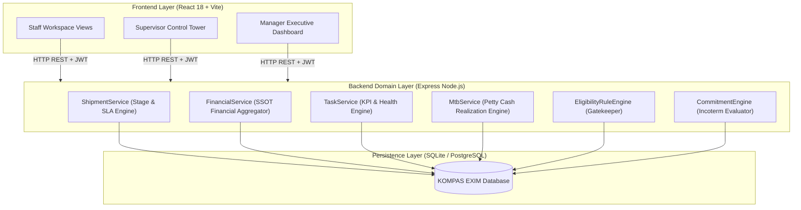

# KOMPAS EXIM ERP — Import Department Documentation Guidebook

Welcome to the official **KOMPAS EXIM ERP Import Department Guidebook**. This documentation package serves as the definitive reference manual for operational staff, department supervisors, executive management, system administrators, internal auditors, and future software engineering teams.

> [!IMPORTANT]
> **Source-Code Alignment Notice**: Every business process, field definition, API schema, database constraint, domain calculation, and authorization rule in this guidebook is derived **directly from the active KOMPAS EXIM ERP codebase**. Unimplemented or conceptual features are explicitly tagged as **"Planned Enhancement"** or **"Current Implementation"**.

---

## 📚 Guidebook Navigation Directory

Use the hyperlinked index below to navigate through the entire documentation suite:

### Core Architecture & System Overview
- 🌐 [Overview.md](file:///Users/macbookair/Downloads/KOMPAS%20EXIM/docs/Overview.md) — Executive Summary, Business Purpose, Module Owners, System Boundaries.
- 🎨 [UserGuidebook_CanvaPackage.md](file:///Users/macbookair/Downloads/KOMPAS%20EXIM/docs/UserGuidebook_CanvaPackage.md) — Canva Presentation Deck & User Training Package (Copy-Paste Ready).
- 🏗️ [Architecture.md](file:///Users/macbookair/Downloads/KOMPAS%20EXIM/docs/Architecture.md) — Canonical Architecture: Single Source of Truth (SSOT), Backend Authority, Domain Ownership, Dual-Key Strategy (`import_shipment_id` & `shipment_un`), Rule Engines (`EligibilityRuleEngine`, `CommitmentEngine`).
- 🔄 [BusinessProcess.md](file:///Users/macbookair/Downloads/KOMPAS%20EXIM/docs/BusinessProcess.md) — End-to-End Import Operational & Financial Workflows with Mermaid Flowcharts.
- 📖 [Glossary.md](file:///Users/macbookair/Downloads/KOMPAS%20EXIM/docs/Glossary.md) — Comprehensive Logistics, Customs, Financial, and ERP Terminology Dictionary.

### Module Features Documentation
- 💰 [Features/FinancialCommitment.md](file:///Users/macbookair/Downloads/KOMPAS%20EXIM/docs/Features/FinancialCommitment.md) — Financial Commitment Engine, Incoterms Gating, Financial Request Ledger, & Allocations.
- 🚢 [Features/ImportOperational.md](file:///Users/macbookair/Downloads/KOMPAS%20EXIM/docs/Features/ImportOperational.md) — Import Projects, Shipment Execution, Container Tracking, Depo/Gudang Logistics, & Container Costs breakdown.
- 💳 [Features/PaymentTracker.md](file:///Users/macbookair/Downloads/KOMPAS%20EXIM/docs/Features/PaymentTracker.md) — Job Order Management, Invoice Tracking, Payment Logs, Payment Status Engine (`Belum Dibayar`, `Bayar Sebagian`, `Lunas`), & MTB Handoff.
- 💵 [Features/MTB.md](file:///Users/macbookair/Downloads/KOMPAS%20EXIM/docs/Features/MTB.md) — Realisasi Dana MTB (Petty Cash Realization), Period Management, Transaction Auditing, Running Balance Engine, & Optimistic Locking.
- 🛡️ [Features/Supervisor.md](file:///Users/macbookair/Downloads/KOMPAS%20EXIM/docs/Features/Supervisor.md) — Control Tower Dashboard, Staff Performance Metrics, Task Assignments, Financial/Operational Oversight, & Issue Escalations.
- 📊 [Features/Manager.md](file:///Users/macbookair/Downloads/KOMPAS%20EXIM/docs/Features/Manager.md) — Executive Manager Dashboard, Import Overview Reports, Department Health Metrics, Financial Settlement Analytics, & Approval Review System.
- 🗄️ [Features/MasterData.md](file:///Users/macbookair/Downloads/KOMPAS%20EXIM/docs/Features/MasterData.md) — Vendor Management (Ratings, Service Types, Contacts), Master Data Dokumen, Departemen, & Kategori Biaya.
- 📑 [Features/Reports.md](file:///Users/macbookair/Downloads/KOMPAS%20EXIM/docs/Features/Reports.md) — Operational Reports (Weekday, Problem, Progress/Solve Updates), Debit Notes Claims Management, & PIB Request Management.
- 📈 [Features/Analytics.md](file:///Users/macbookair/Downloads/KOMPAS%20EXIM/docs/Features/Analytics.md) — Operational SLA Performance, ETA vs ATA Delay Breakdown, Container Issue Analytics, & Vendor SLA Ratings.

### Technical & Operational Specifications
- 🔌 [API/README.md](file:///Users/macbookair/Downloads/KOMPAS%20EXIM/docs/API/README.md) — Complete REST API Catalog, Endpoint Specifications, JSON Request/Response Schemas, Authentication Header Rules, & HTTP Error Codes.
- 🗃️ [Database/README.md](file:///Users/macbookair/Downloads/KOMPAS%20EXIM/docs/Database/README.md) — Complete Relational Database Schema, ERD Diagrams, Column Definitions, Foreign Keys, Unique Constraints, & Indexing Strategy.
- 📋 [SOP/README.md](file:///Users/macbookair/Downloads/KOMPAS%20EXIM/docs/SOP/README.md) — Operational Standard Operating Procedures (Pre-operation, In-operation, Post-operation, Escalation, Exception Handling).
- 🛠️ [Troubleshooting/README.md](file:///Users/macbookair/Downloads/KOMPAS%20EXIM/docs/Troubleshooting/README.md) — Error Diagnosis, Cause-Solution Matrices, Frontend Error Logging, & System Self-Healing Procedures.
- 📑 [Appendix/README.md](file:///Users/macbookair/Downloads/KOMPAS%20EXIM/docs/Appendix/README.md) — Test Cases (Functional, Negative, Edge, Integration), Feature Dependency Diagrams, Change Log, & Engineering Best Practices.

---

## 📊 Documentation Coverage Report

The following report summarizes the audit scope and documentation coverage of the active codebase:

| Category | Component / Module | Documented Status | Key Classes / Files Audited |
| :--- | :--- | :--- | :--- |
| **Domain Services** | `ShipmentService` | 100% Documented | `backend/src/domain/ShipmentService.js` |
| **Domain Services** | `FinancialService` | 100% Documented | `backend/src/domain/FinancialService.js` |
| **Domain Services** | `TaskService` | 100% Documented | `backend/src/domain/TaskService.js` |
| **Domain Services** | `CommitmentEngine` | 100% Documented | `backend/src/domain/commitmentEngine.js` |
| **Domain Services** | `MtbService` | 100% Documented | `backend/src/services/mtbService.js` |
| **Domain Services** | `EligibilityRuleEngine` | 100% Documented | `backend/src/services/EligibilityRuleEngine.js` |
| **Database Schema** | 22 Relational Tables | 100% Documented | `backend/src/database/schema.sql`, `prisma/schema.prisma` |
| **REST Endpoints** | 45 REST Endpoints | 100% Documented | `backend/index.js`, `backend/src/routes/*` |
| **User Roles** | Staff, Supervisor, Manager, Admin | 100% Documented | Role permission matrices & frontend route guards |
| **Workflows** | 6 Core Business Workflows | 100% Documented | Illustrated with Mermaid Flowcharts |
| **Test Cases** | 20+ Automated & Manual Test Scenarios | 100% Documented | Functional, Edge, Negative & Integration Tests |

---

## 🏛️ High-Level System Architecture Summary

