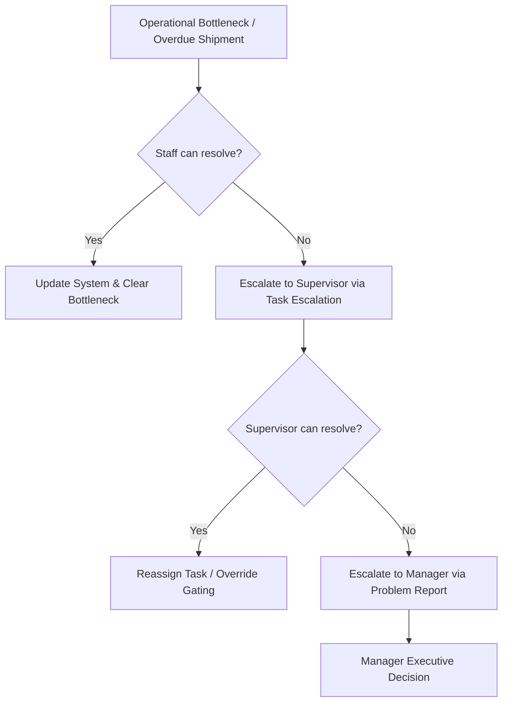

# KOMPAS EXIM ERP — Standard Operating Procedures (SOP)

This document details the mandatory operational procedures for import staff, supervisors, and executive managers operating the KOMPAS EXIM ERP system.

---

## 1. SOP-IMP-001: Import Project Creation & Financial Commitment

### Operational Objective
To register new inbound import orders and generate initial financial commitments.

### Phase 1: Pre-Operation Requirements
1. Verify Supplier Purchase Order (PO) and Proforma Invoice.
2. Confirm Incoterms (e.g. FOB Shanghai, CIF Jakarta) and transport mode (FCL/LCL).

### Phase 2: In-Operation Instructions
1. Navigate to **Workspace → Assign Import Project**.
2. Click **+ Import Project Baru**.
3. Input UN Number, Supplier Name, Import Type, Incoterm, Estimated Departure (ETD), and Estimated Arrival (ETA).
4. Click **Simpan Project**.

### Phase 3: Post-Operation Verification
- Verify that `CommitmentEngine` auto-populates financial ledger rows in **Financial Request Ledger**.

---

## 2. SOP-IMP-002: Container Logistics & Milestone Tracking

### Operational Objective
To record container movements from vessel arrival through factory unloading and empty container return.

### Instructions:
1. When vessel arrives at port, enter **ATA (Actual Time of Arrival)** date in `ShipmentDetail.jsx`.
2. As containers exit the port, input **Gate Out Port** timestamp and select Trucking Vendor.
3. Upon warehouse arrival, input **Gate In WH** timestamp.
4. When offloading finishes and empty container returns to depo, input **Gate Out WH** timestamp.
5. If container experiences quarantine or port delay, toggle issue flags (`Fish Issue`, `Queue Issue`, `Space Issue`).

---

## 3. SOP-IMP-003: Realisasi Dana MTB Petty Cash Realization

### Operational Objective
To process cash advances and settle petty cash expenses.

### Instructions:
1. Ensure target Job Order is marked **Lunas** (Fully Paid).
2. Open active MTB period in **Finance → Realisasi Dana → Tab MTB**.
3. Click **Assign JO to MTB** or **+ Tambah Transaksi Manual**.
4. Enter payment date, kwitansi number, tax withholding (PPh23), and bank admin fees.
5. Click **Simpan Transaksi**. System auto-calculates `saldo_running`.
6. Submit period to Supervisor when period ends.

---

## 4. SOP Escalation Matrix

