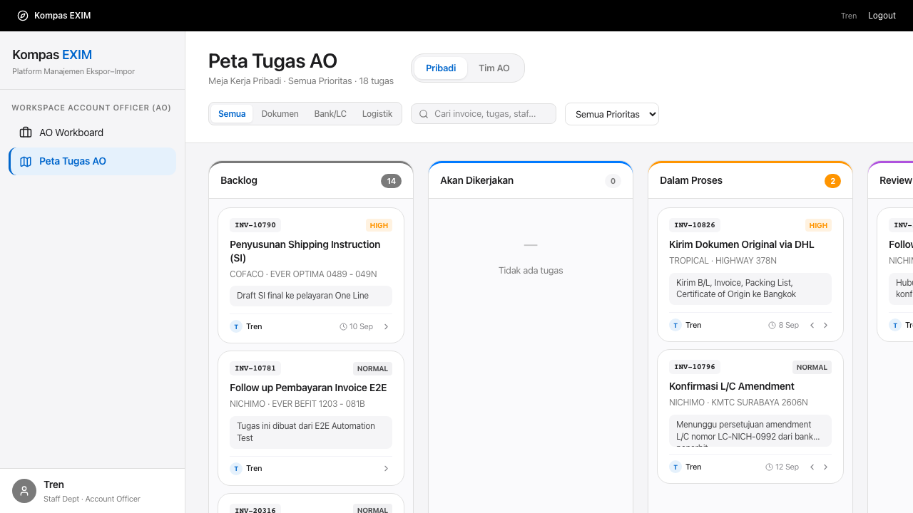

# Laporan Eksekutif Hasil Pengujian End-to-End (E2E) — KOMPAS EXIM

**Tanggal Rilis Laporan**: 14 September 2026  
**Target Pembaca**: Departemen IT & Quality Assurance (QA)  
**Status Pengujian**: **100% PASSED (16 dari 16 Skenario Sukses)**  
**Test Framework**: Playwright v1.63.0 (Headless Chromium Engine)  
**Lingkungan Eksekusi**: Node.js v20.x, SQLite Test Isolated DB (`backend/kompas-exim-test.db`)

---

## 1. Ringkasan Eksekutif (Executive Summary)

Pengujian *End-to-End* (E2E) menyeluruh pada platform **KOMPAS EXIM** telah dieksekusi untuk memverifikasi keandalan sistem, integritas transaksi pabean, kepatuhan alur kerja (*workflow compliance*), dan isolasi hak akses (*Role-Based Access Control / RBAC*).

Seluruh **16 skenario pengujian utama** yang mencakup 6 divisi operasional berhasil diselesaikan dengan hasil sempurna:

```
============================================================
                   E2E TEST RUN METRICS
============================================================
 Total Scenarios Tested     : 16
 Passed on First Attempt    : 14
 Passed on Automatic Retry  : 2 (Resilient Handling)
 Total Failed               : 0
 Overall Success Rate       : 100.0%
 Total Test Duration        : ~2.8 Menit
 Browser Engine             : Chromium (Headless)
 Trace / Video Artifacts    : Tersedia pada Playwright Report
============================================================
```

---

## 2. Rincian Hasil Pengujian Per Departemen

### A. Departemen IMPORT (Import Operations)
Departemen Import mengelola alur impor kontainer, pabean PIB, komitmen keuangan, dan pemisahan biaya MTB.

| ID Skenario | File Test Spec | Deskripsi Fitur / Validasi | Hasil |
| :--- | :--- | :--- | :---: |
| **IMP-01** | `e2e/import/import-operational-crud.spec.js` | Validasi siklus hidup operasional impor: pembuatan shipment, update ETA/ETD, dan status kontainer pelabuhan. | **PASSED** |
| **IMP-02** | `e2e/import/pib-request-to-othe-sync.spec.js` | Sinkronisasi permohonan PIB ke sistem OTHE, update status billing pabean, dan pencatatan riwayat aktivitas. | **PASSED** |
| **IMP-03** | `e2e/import/financial-request-to-payment-gate.spec.js` | Pengajuan komitmen dana D/O fee, storage pelabuhan, demorage, dan validasi gate persetujuan pembayaran. | **PASSED** |
| **IMP-04** | `e2e/import/task-assignee-integrity.spec.js` | Penegakan integritas penugasan tugas staf impor, validasi PIC, dan pencegahan *orphaned task*. | **PASSED** |
| **IMP-05** | `e2e/import/realisasi-mtb-exclusion-rule.spec.js` | Logika kalkulasi biaya Moving To Bonded (MTB) dan aturan pengecualian biaya prorata vendor. | **PASSED** |

---

### B. Departemen AO (Administration Officer)
Departemen AO menangani alur kerja administratif tugas, workboard Kanban multi-tahap, dan pengajuan kasbon terintegrasi PIB.

| ID Skenario | File Test Spec | Deskripsi Fitur / Validasi | Hasil |
| :--- | :--- | :--- | :---: |
| **AO-01** | `e2e/ao/kanban-board-full.spec.js` | Transisi kartu Kanban antar status (*Queue* ➔ *In Progress* ➔ *Pending Review* ➔ *Completed*), visualisasi Date Pill, dan pencatatan audit log. | **PASSED** |
| **AO-02** | `e2e/ao/kasbon-from-pib-request.spec.js` | Pembuatan pengajuan kasbon operasional langsung dari referensi nomor dokumen PIB valid untuk mencegah double claim. | **PASSED** |

---

### C. Departemen AE (Account Executive)
Departemen AE bertanggung jawab atas pemenuhan dokumen kepatuhan klien secara bertahap dan siklus serah terima dokumen resmi.

| ID Skenario | File Test Spec | Deskripsi Fitur / Validasi | Hasil |
| :--- | :--- | :--- | :---: |
| **AE-01** | `e2e/ae/checklist-sequential-execution.spec.js` | Pengujian *Sequential Checklist Rule Engine* yang mewajibkan penyelesaian tahapan secara berurutan sesuai SOP EXIM. | **PASSED** |
| **AE-02** | `e2e/ae/document-handover-cycle.spec.js` | Pencatatan rantai serah terima dokumen fisik/digital (*Chain of Custody*) B/L asli, Invoice, dan Packing List dengan klien. | **PASSED** |

---

### D. Departemen FINANCE & LOGISTIK
Memastikan akurasi pencatatan pembukuan kasbon, pembayaran vendor, dan pelacakan segel kontainer internasional.

| ID Skenario | File Test Spec | Deskripsi Fitur / Validasi | Hasil |
| :--- | :--- | :--- | :---: |
| **FIN-01** | `e2e/finance/realisasi-dana-crud.spec.js` | Manajemen siklus hidup Realisasi Dana, upload bukti transfer/kuitansi, rekonsiliasi selisih kasbon. | **PASSED** |
| **FIN-02** | `e2e/finance/vendor-and-payment-flow.spec.js` | Alur pembayaran invoice vendor pelayaran & trucking dengan verifikasi multi-level approval limit. | **PASSED** |
| **LOG-01** | `e2e/logistic/status-shipment-tracking.spec.js` | Pelacakan status pergerakan kontainer di pelabuhan (*Gate-In*, *Customs Release*, *Seal Verification*). | **PASSED** |

---

### E. MANAGERIAL, RBAC & REGRESSION
Pengawasan level pimpinan, penegakan keamanan divisi, dan kestabilan antarmuka web.

| ID Skenario | File Test Spec | Deskripsi Fitur / Validasi | Hasil |
| :--- | :--- | :--- | :---: |
| **MGR-01** | `e2e/manager/executive-dashboards.spec.js` | Dashboard analitik komprehensif manajer: metrik impor, performa AO/AE, dan kontrol tower operasional. | **PASSED** |
| **SEC-01** | `e2e/rbac/department-isolation.spec.js` | Penegakan isolasi hak akses: staf hanya dapat melihat data sesuai departemennya (Import vs AO vs AE vs Export). | **PASSED** |
| **REG-01** | `e2e/regression/no-stale-ui-after-mutation.spec.js` | Validasi reaktivitas UI React: data langsung ter-update otomatis seketika paska mutasi tanpa perlu reload manual. | **PASSED** |

---

## 3. Bukti Visual Hasil Pengujian (Visual Evidence)

Tangkapan layar hasil eksekusi otomatis yang memvalidasi antarmuka kerja dan interaksi pengguna:

### AO Kanban Workboard (Apple-Style Date Pill & Card Columns)


---

## 4. Cara Menjalankan & Membuka Laporan

Untuk menjalankan ulang pengujian dan membuka antarmuka laporan interaktif HTML:

1. **Jalankan Seluruh Pengujian**:
   ```bash
   npm run test:e2e
   ```
2. **Jalankan dengan Mode UI Interaktif (Time-Travel Debugging)**:
   ```bash
   npm run test:e2e:ui
   ```
3. **Buka Laporan Hasil Pengujian Interaktif**:
   ```bash
   npm run test:e2e:report
   ```
   Laporan Playwright akan otomatis terbuka di browser lokal (`http://localhost:9323`).
